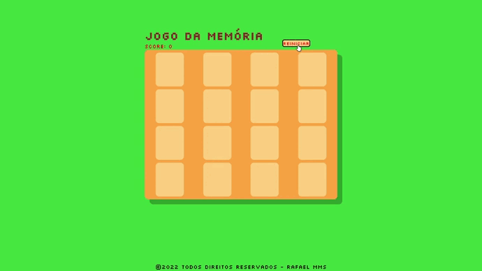

# Sobre:

Projeto construído para fins didáticos, com o objetivo de colocar em prática os conhecimentos de HTML, CSS e JavaScript aprendidos na semana de Lógica de Programação da Imagine School, e o objetivo foi desenvolver este jogo da memória acomphando os fundamentos e conceitos para construção e fixação do conteúdo. Nesta semana pude aprimorar meus conhecimentos em HTML, CSS e principalmente o JavaScript e comforme ia entendendo o conteúdo fui personalizando do meu jeito e aproveitei para implementar mais uma função, ainda precisa de uns ajustes na parte de responsividade que irei fazer mais a frente, no mais gostei bastante de fazer este jogo para aprimorar meus conhecimentos.
 

# Tecnologias usadas:

<li>HTML</li>
<li>CSS</li>
<li>JavaScript</li>

# IDE usada:

<li>Visual Studio Code</li>
